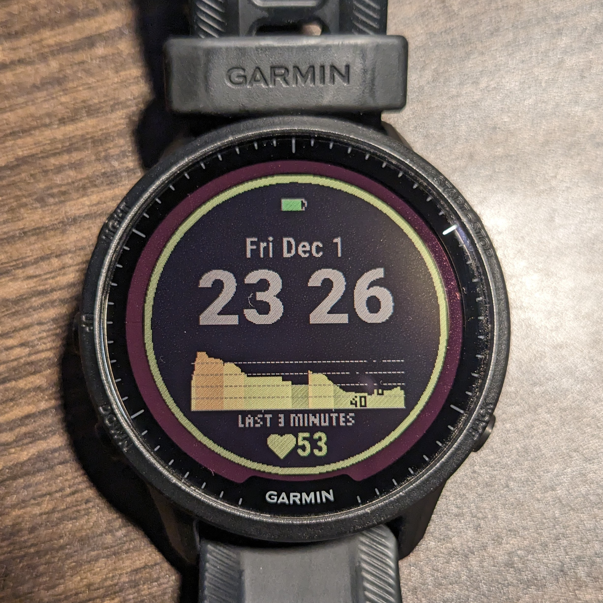

# StressWatchFace

This is a custom watch face for the Garmin watch. It has a rolling bar graph of the last few minutes of the wearer's heart rate. This can be used to infer stress level. The lower the heart rate then the lower the stress.

By wearing this watch face for many days you will have an understanding of how your heart can vary. You will learn how your heart can accelerate or calm down. You will observe the impact of thoughts and stress on your heart rate. Even if you think you are calm, then your heart rate may not reflect that. This contrast will encourage you to observe the subtleties in your body and be more self aware. You will learn differences between sitting, standing, walking and that resting heart rate isn't just for sleeping but for sitting or working too... How's that for an infomercial?



The rolling bar graph is colour coded showing the heart beat for the last three minutes. The graph is 180 pixels in width meaning that each bar represent one second. The higher the heart beat, the more redder is the colour. If your heart rate is more calm and slow then the colour is more green. This is meant to be a visual feedback mechanism to let you know when you are too stressed.

The current heart rate is displayed at the bottom and is also colour coded based on the same colour scheme as the graph. A ring is drawn around the watch perimeter with the same colour as the heart rate to make it easier for the user to get the visual feedback: "is my heart rate too high? Let's calm down.". The heart rate alone would be sufficient for feedback but the graph gives you the context of how your heart rate is changing. The benefit of the history context is hard to describe without trying it out. 


The graph has horizontal dashed lines that represent an increase in ten heart beats per minute from the dashed line below it. The numbers towards the right hand side of the graph assist in describing these ranges.

## How To Install 

This watch is currently only for Garmin 955 Solar Forerunner watch.

You will need to set up Visual Code with Garmin's Monkey C language as instructed [here](https://developer.garmin.com/connect-iq/reference-guides/visual-studio-code-extension/). Once you have opened the cloned project then you can go to Visual Code and go to `Run > Start Debugging` (and selecting `Monkey C` as debugger). The output will be in `bin/StressWatchFace.prg`. Connect your watch to your computer via the charging cable and copy the `prg` file to `GARMIN/Apps`. Then disconnect the cable and then in watch change the watch face to the new watch face.

## How To Customize

The current heart rate graph is built for a resting heart rate of 40 with the most 'green' (i.e. 'good') colour being in the 40s range. This resting heart rate along with colour coding in graph can be modified in `ManyrayWatchfaceView.mc` via:

```
  var minValHeart = 40;
  var maxValHeart = 110;
  var heartColourDict = {
 ```

If you want to display 10 minutes or 5 minutes instead of three then you can modify `minutesToTrackHeartBeat` in `MannyrayWatchFaceApp.mc`.


## Future Work

The watch face was coded and designed specifically for the Garmin 955 Solar Forerunner watch. This watch face can be extended to other watches too.


Unfortunately, the installation is a bit involved and requires some programming experience. The watch code can eventually be placed on the Connect download store too to avoid manual installation.
